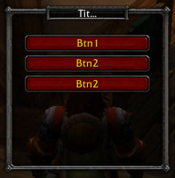

# WowCompose

Это начальная стадия разработки UI фреймворка для создания пользовательских интерфейсов World of Warcraft в декларативном стиле. Цель проекта — предоставить разработчикам удобный и интуитивно понятный способ верстки аддонов, используя подходы, вдохновленные современными UI-фреймворками.

## Особенности

*   **Декларативный UI:** Определяйте, как должен выглядеть ваш интерфейс, а не как его рисовать.
*   **Компонентный подход:** Создавайте переиспользуемые UI-компоненты для модульной и легко поддерживаемой кодовой базы.
*   **Гибкая система модификаторов:** Настраивайте внешний вид и поведение компонентов с помощью цепочки модификаторов.
*   **Встроенные макеты:** Используйте `Row`, `Column` и `Box` для простого размещения элементов.

## Установка и использование

Чтобы использовать WowCompose в своем аддоне, выполните следующие шаги:

1.  **Клонируйте репозиторий:**
    Клонируйте этот репозиторий в папку `Interface\AddOns` вашей установки World of Warcraft. Например, вы можете назвать папку `WowComposeLib`.

    ```bash
    cd "C:\Program Files (x86)\World of Warcraft\Interface\AddOns"
    git clone https://github.com/NovbiChannel/WowCompose.git WowComposeLib
    ```

2.  **Подключите WowCompose к вашему аддону:**
    В файле `.toc` вашего аддона добавьте ссылки на файлы WowCompose. Это позволит вашему аддону использовать функции фреймворка.

    Пример `YourAddon.toc`:

```
    ## Interface: 100207
    ## Title: Your Awesome Addon
    ## Notes: A description of your awesome addon.
    ## Dependencies: WowComposeLib

    # WowComposeLib files
    WowComposeLib\ui.xml
    WowComposeLib\layouts.xml
    WowComposeLib\button.xml
    WowComposeLib\text.xml
    WowComposeLib\Component.lua

    # Your Addon files
    YourAddon.lua
```

**Важно:** Убедитесь, что файлы WowCompose загружаются до ваших собственных скриптов, которые их используют.

3.  **Начните верстку интерфейса:**
    Теперь вы можете использовать компоненты WowCompose для создания интерфейса вашего аддона.

    Пример использования в вашем файле `.lua`:

```lua
    -- Ваш код аддона
    local MyAddonFrame = Box(
        Modifier:new()
            :setSize(300)
            :setBackground(Textures.DialogFrame, BorderSize.Large)
            :setMovable()
            :setAnchor(Alignment.Center),
        function(parent)
            Text(
                "Привет, WowCompose!",
                Modifier:new():setAnchor(Alignment.Center),
                nil,
                TextStyle.NORMAL_HUGE
            )(parent)

            Button(
                "Нажми меня!",
                Modifier:new()
                    :setWidth(150)
                    :setHeight(30)
                    :setAnchor(Alignment.Bottom),
                nil,
                function()
                    print("Кнопка нажата!")
                end
            )(parent)
        end
    )(UIParent) -- Прикрепляем к основному UI-фрейму игры

    -- Показать/скрыть фрейм
    SLASH_MYADDON = "/myaddon"
    SlashCmdList["MYADDON"] = function()
        if MyAddonFrame:IsShown() then
            MyAddonFrame:Hide()
        else
            MyAddonFrame:Show()
        end
    end
```

## Пример результата верстки

Ниже представлен пример простого интерфейса, созданного с помощью WowCompose. Файл `WowCompose/Test.lua` служит демонстрацией возможностей фреймворка и содержит тестовую команду `/compose` для его визуализации.



```lua
    -- Файл: MultipleFiles/Test.lua
    SLASH_COMPOSE1 = "/compose"

    ---@param text string
    ---@param parent UIParent
    local function UiButton(text, parent)
        local btn = Button(
            text,
            Modifier:new()
                :fillMaxWidth(parent),
            nil,
            function()
                print("Click for "..text.." button")
            end
        )(parent)

        return btn
    end

    local ui = Box(
                Modifier:new()
                    :setSize(200)
                    :setBackground(Textures.DialogFrame, BorderSize.Large)
                    :setMovable()
                    :setAnchor(Alignment.Center),
                function(parent)
                    Box(
                        Modifier:new()
                            :setWidth(100)
                            :setHeight(20)
                            :setBackground(Textures.DialogFrame, BorderSize.Medium)
                            :setAnchor(Alignment.Top),
                            function (_parent)
                                Text(
                                    "Title",
                                    Modifier:new():setAnchor(Alignment.Center),
                                    nil,
                                    TextStyle.TOOLTIP_TEXT
                                )(_parent)
                            end
                    )(parent)

                    Column(
                        Modifier:new()
                            :setPaddingHorizontal(24)
                            :setPaddingVertical(32)
                            :fillMaxSize(parent)
                            :setAnchor(Alignment.Center)
                        , 2 ,
                        function (_parent)
                            UiButton("Btn1", _parent)
                            UiButton("Btn2", _parent)
                            UiButton("Btn2", _parent)
                        end
                    )(parent)
                end
            )(UIParent)

    SlashCmdList["COMPOSE"] = function()
        if ui:IsShown() then
            ui:Hide()
        else
            ui:Show()
        end
    end
```
## Структура проекта

Проект организован следующим образом:

* **Button.lua**: Реализация компонента кнопки.
* **Box.lua**: Компонент для создания контейнеров.
* **Column.lua**: Компонент для вертикального расположения элементов.
* **Row.lua**: Компонент для горизонтального расположения элементов.
* **Text.lua**: Компонент для отображения текста.
* **Modifier.lua**: Система модификаторов для настройки компонентов.
* **Alignment.lua, Border.lua, Layer.lua, Padding.lua, Textures.lua, TextStyle.lua**: Вспомогательные файлы с перечислениями и утилитами.
* **Component.lua**: Базовая функция для создания UI-фреймов.
* **Test.lua**: Демонстрационный файл, содержащий пример использования фреймворка и тестовую команду /compose.
* **.xml**: Файлы для регистрации скриптов в WoW.

## Вклад

Мы приветствуем любой вклад в развитие проекта! Если у вас есть идеи, предложения или вы хотите сообщить об ошибке, пожалуйста, создайте Issue или Pull Request.  